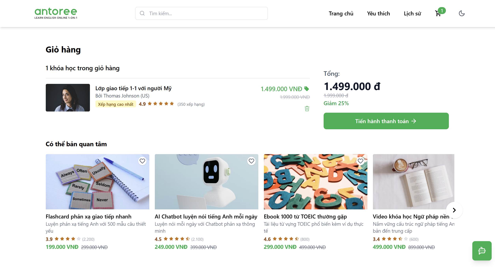
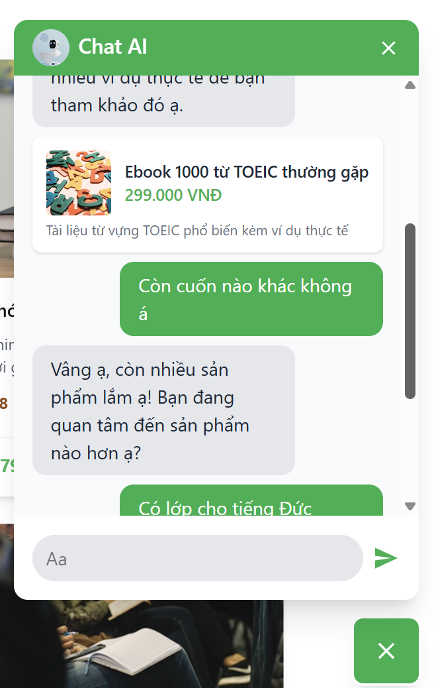

# Edushop AI – Sàn giáo dục thương mại điện tử tích hợp AI

> Dự án Front-end mô phỏng một sàn thương mại điện tử cho sản phẩm giáo dục, giúp người học tìm kiếm, lọc, và khám phá các khóa học phù hợp – tích hợp gợi ý AI dựa trên hành vi người dùng.

## Demo

[Xem bản demo trên Vercel tại đây](https://edushop-ai-fe.vercel.app/)

## Ảnh minh họa

| Trang chủ                       | Giỏ hàng và gợi ý trong giỏ hàng | Chatbot AI                       |
| ------------------------------- | -------------------------------- | -------------------------------- |
|  |        |  |

## Tính năng chính

### 1. Danh sách sản phẩm

- Danh sách sản phẩm giáo dục: tên, mô tả, giá, ảnh, đánh giá...
- Thiết kế hiện đại, responsive, thân thiện người dùng.

### 2. Tìm kiếm & Bộ lọc

- Tìm kiếm sản phẩm theo tên.
- Bộ lọc động theo loại, cấp độ, giá, đánh giá...
- Responsive sidebar filter (ẩn/hiện linh hoạt trên mobile).

### 3. Gợi ý thông minh (AI)

- Nút "Gợi ý sản phẩm phù hợp" dựa trên hành vi người dùng (đã xem, đã thích, lịch sử xem).
- Có loading skeleton và xử lý lỗi khi API fail.

### 4. Yêu thích sản phẩm

- Đánh dấu yêu thích sản phẩm.
- Trang riêng hiển thị danh sách sản phẩm yêu thích.
- Thông báo trạng thái (toast) khi thêm/bỏ yêu thích.

### 5. Lịch sử xem sản phẩm

- Ghi nhớ các sản phẩm đã click "Xem chi tiết".
- Dùng để hỗ trợ logic gợi ý AI.

### 6. Chatbot AI

- Giao diện chatbot AI đơn giản.
- Tích hợp **Gemma AI** để tư vấn khóa học phù hợp.

### 7. Giỏ hàng (Cart)

- Thêm/xóa sản phẩm vào giỏ, tính tổng tiền.
- Giao diện đơn giản, dễ sử dụng.

## Công nghệ sử dụng

| Công nghệ     | Mô tả                            |
| ------------- | -------------------------------- |
| React         | Thư viện chính xây dựng UI       |
| TypeScript    | Kiểm tra kiểu tĩnh, code rõ ràng |
| Tailwind CSS  | Thiết kế hiện đại, responsive    |
| Framer Motion | Animation mượt mà                |
| React Router  | Quản lý định tuyến trang         |
| Axios         | Gọi API giả lập                  |
| Sonner        | Toast notification               |
| LocalStorage  | Lưu yêu thích & lịch sử xem      |

---

## Cách chạy dự án

### 1. Clone project

```bash
git clone https://github.com/daclong1706/edushop-ai-fe.git
cd edushop-ai
```

### 2. Cài đặt dependencies

```bash
npm install
# hoặc
yarn install
```

### 3. Chạy local dev

```bash
npm run dev
```

### 4. Build production (tuỳ chọn)

```bash
npm run build
```

## Tác giả

Tên: Nguyễn Đắc Long

Email: [daclong.k17@gmail.com]

GitHub: https://github.com/daclong1706

Demo: https://edushop-ai-fe.vercel.app
